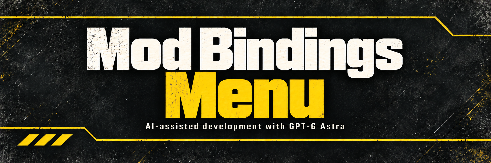

# Mod Bindings Menu v2.0

Adds a native **MODS** tab next to General, Combat and Communication on both the Mouse & Keyboard and Controller binding pages. Every mod binding lives there, grouped under one section header per mod. Rows use Helldivers 2's own capture widgets, activation types (Press, Hold, Double Tap, Long Press and so on) and saved input settings, and bindings work on keyboard, mouse and controller. Up to **36** bindings can be registered across all installed mods. Two mods may use the same key.

[Ship Station Hotkeys](https://github.com/CowboyBingus/ShipStationHotkeys/releases/latest) (formerly Galactic Menu Hotkey) registers its six shortcuts here, defaulting to Tab, F1 and F5–F8.

Install [the release ZIP](https://github.com/CowboyBingus/ModBindingsMenu/releases/latest) and [Bingus Shared Loader v17 or newer](https://github.com/CowboyBingus/BingusSharedLoader/releases/latest), plus the mods that use it. Mod Bindings Menu is a separate dependency and is not bundled in Vanilla Plus Megapack. Enable and deploy, then restart the game. Keep the shared loader as the winning Wwise startup replacement. The bindings mod ships its own `content/input.config` override; another mod that replaces that resource must be merged with it.

## How it works

The tab bar, section headers and rows are drawn by the game. Mod bindings are backed by 36 native input actions from developer-only groups (Freeflight, CinematicCamera, DebugAvatar and Debugmenu) that retail play never reads. Because they are real game actions, the game evaluates each binding's activation type on every device and saves your keys in its own input settings. The developer default mappings those actions shipped with (mouse, controller and some keys) are removed automatically, so only the keys you or a mod's default assign can trigger a binding.

Section headers and text labels borrow unused localization cache entries only while the bindings page is open. Automatically assigned actions are remembered per binding in `%LOCALAPPDATA%\CowboyBingus\Helldivers2\Logs\ModBindingsMenu.assignments`, so keys stay with the right binding across sessions and load orders. The native offsets and input resource are for Steam build **25480438** only; the addon checks the executable and DLL hashes before touching the bindings UI, and the packaged input resource must be rebuilt after a game update. It conflicts with other mods that use the same developer input actions.

## For mod authors

Make Mod Bindings Menu and Bingus Shared Loader requirements of your own separately packaged addon. Register bindings and read them each frame:

```lua
-- HD2-Addon: mods/example/your_mod
local BINDING_ID = 'example.your_mod.toggle_hud'
local registered, was_down = false, false
local hud_visible = true

local function step()
    local menu = rawget(_G, 'ModBindingsMenu')
    if not menu or menu.api ~= 1 then return end

    -- The two addons may load in either order. Retry until registration works.
    if not registered then
        -- Version 2: no slot (nil) assigns a free native action automatically.
        local ok = menu.register_binding(BINDING_ID, 'Toggle HUD', nil,
                                         {category = 'Your Mod'})
        if not ok then return end
        registered = true
    end

    local down = menu.is_down(BINDING_ID)
    if down == nil then return end -- Native input is still loading.
    if down and not was_down then
        hud_visible = not hud_visible
        -- Apply hud_visible to your mod's UI here.
    end
    was_down = down
end

local previous_update = rawget(_G, 'update')
update = function(dt)
    step()
    if type(previous_update) == 'function' then return previous_update(dt) end
end
```

- `register_binding(id, label, slot, options)` returns `true`, or `false` and a reason. `id` is a stable unique string; it keys the user's saved binding, so never change it. `label` is row text (a string) or a game localization ID (a number). `options.category` names your mod's section header; without it the header is derived from your addon's `mods/<author>/<entry>` name.
- `slot` `nil` or `0` assigns a free action automatically and keeps it for that `id` in later sessions. Slots `1`–`7` are the fixed Mod Bindings Menu v1 slots (1 and 3–7 belong to Ship Station Hotkeys). A v1.1 addon asking for slot 2 while another addon holds it is assigned automatically instead of failing. When all 36 actions are taken, an action reserved by an addon that did not register this session is reused and its old keys are cleared.
- `is_down(id)` returns `nil` while native input is unavailable, then whether the binding's activation is satisfied this frame on any device. For Press, Tap and Double Tap that is a short pulse; for Hold it stays true while held. Detect edges as above and apply any gameplay or focus guards your mod needs.
- `ready()` reports whether native input is available. `version` is `2` and `capacity` is `36`; `api` stays `1`, so v1.1 addons keep working unchanged.

Automatically assigned bindings start unbound, so tell users to set a key on the MODS tab. [tests/live/binding_test.lua](tests/live/binding_test.lua) is a complete example that registers twelve automatic bindings and logs every activation.

## Validation

Clone BingusSharedLoader beside this repository. Set `HD2_INPUT_CONFIG` to your locally extracted, unmodified `content/input.config` from Steam build 25480438; its checksum is validated before use. Game captures are not included in the source repository. Run `python -B tests/test_build.py` to validate the resource and build `releases/Mod-Bindings-Menu-v2.0.zip`. With the game installed, run `python tests/run_game_lua.py --run tests/test_api.lua` and `python tests/run_game_lua.py --run tests/test_mods_tab.lua` to check the registration contract, the MODS tab, the label pool, native activation and the removal of inherited developer mappings against simulated game memory.

Live tests confirmed the MODS tab on both binding pages, per-mod section headers, twelve automatic bindings, Double Tap, duplicate keys and bindings persisting across restarts. Controller button activation and the removal of the inherited mouse and controller mappings are verified offline only.

[Artwork and generation prompts](assets/ARTWORK.md). AI-assisted development with GPT-6 Astra and Claude.
