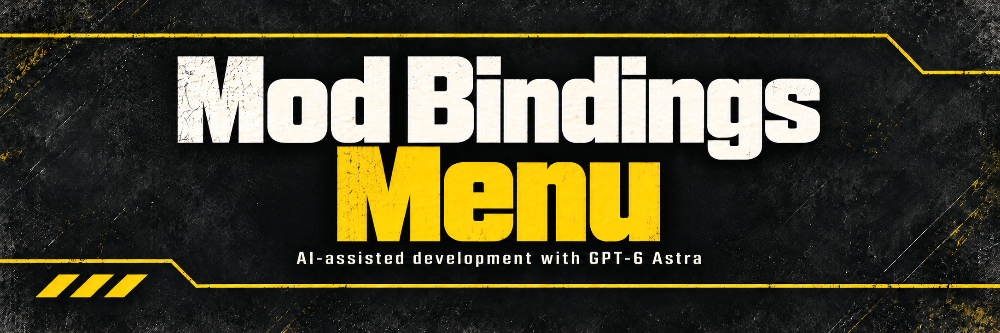

# Mod Bindings Menu v2.2

Adds a native **MODS** tab next to General, Combat and Communication on both the Mouse & Keyboard and Controller binding pages. Every mod binding lives there, grouped under one section header per mod. Rows use Helldivers 2's own capture widgets, activation types (Press, Hold, Double Tap, Long Press and so on) and saved input settings, and bindings work on keyboard, mouse and controller. All installed mods share one pool of **36** bindings (29 assigned automatically, 7 fixed slots). Two mods may use the same key.

[Ship Station Hotkeys](https://github.com/CowboyBingus/ShipStationHotkeys/releases/latest) (formerly Galactic Menu Hotkey) registers its six shortcuts here, defaulting to Tab, F1 and F5–F8.

Install [the release ZIP](https://github.com/CowboyBingus/ModBindingsMenu/releases/latest) and [Bingus Shared Loader v18 or newer (v19 is current)](https://github.com/CowboyBingus/BingusSharedLoader/releases/latest), plus the mods that use it. Vanilla Plus Megapack also contains Mod Bindings Menu as an option; use either the Megapack option or this package, not both. Enable and deploy, then restart the game. Keep the shared loader as the winning Wwise startup replacement. The bindings mod ships its own `content/input.config` override; another mod that replaces that resource must be merged with it.

Translatable: the MODS tab follows the game's Text Language, and so do the bindings of mods that pass their texts as functions (see below). [How to translate](TRANSLATING.md).

## How it works

The tab bar, section headers and rows are drawn by the game. Mod bindings are backed by 36 native input actions from developer-only groups (Freeflight, CinematicCamera, DebugAvatar and Debugmenu) that retail play never reads. Because they are real game actions, the game evaluates each binding's activation type on every device and saves your keys in its own input settings. The developer default mappings those actions shipped with (mouse, controller and some keys) are removed once per action, when a mod binding first uses it, so only the keys you or a mod's default assign can trigger a binding. Keys you choose are never removed, even one that equals a developer default. Developer defaults are removed again only when the game restores them: a Revert, a reload of the input configuration, or an older saved settings file. Actions that no mod binding uses in a session are left alone, so another mod that uses those developer actions keeps its keys.

Every frame, the menu's update runs through Bingus Shared Runtime's update guard (`src/bingus_runtime.lua`, an unchanged copy). Its own errors count in bursts, and the 8th of a burst stops it for the session. When the update of a mod below it fails, the menu pauses instead and resumes after 60 frames without such an error: a binding page that was open counts as visited, borrowed texts go back unless a page is open, and your saved keys are never touched. 8 such errors in a burst stop it too. The game's module files are hashed once per session for every mod together (`src/bingus_memory.lua`).

Section headers and text labels borrow unused localization cache entries only while the bindings page is open. Automatically assigned actions are remembered per binding in `%LOCALAPPDATA%\CowboyBingus\Helldivers2\Logs\ModBindingsMenu.assignments`, so keys stay with the right binding across sessions and load orders. The file also records which actions' developer defaults were removed. The previous save is kept beside it as `ModBindingsMenu.assignments.bak`, which is read when the file is missing or damaged. The native offsets and input resource are for Steam build **25480438** only; the addon checks the executable and DLL hashes before touching the bindings UI. On another build the bindings stay inactive, but the packaged `content/input.config` replacement is still deployed and replaces the game's own input configuration: `ModBindingsMenu.log` then warns you to remove the mod or update it. It conflicts with other mods that use the same developer input actions.

## For mod authors

Make Mod Bindings Menu and Bingus Shared Loader requirements of your own separately packaged addon. Register bindings and read them each frame:

```lua
-- HD2-Addon: mods/example/your_mod
local BINDING_ID = 'example.your_mod.toggle_hud'
local menu_seen, registered, refusal, was_down = nil, false, nil, false
local hud_visible = true

local function step()
    -- The two addons may load in either order: wait for the menu's table.
    local menu = rawget(_G, 'ModBindingsMenu')
    if not menu or menu.api ~= 1 then return end
    if menu ~= menu_seen then
        menu_seen = menu
        -- Version 2: no slot (nil) assigns a native action automatically.
        local reason
        registered, reason = menu.register_binding(BINDING_ID, 'Toggle HUD', nil,
                                                   {category = 'Your Mod'})
        -- A refusal lasts the session: keep the reason for your log, once.
        if not registered then refusal = reason end
    end
    if not registered then return end -- Use your own default key here.

    local down = menu.is_down(BINDING_ID)
    if down == nil then return end -- No native input: see below.
    if down and not was_down then
        hud_visible = not hud_visible
        -- Apply hud_visible to your mod's UI here.
    end
    was_down = down
end

local previous_update = rawget(_G, 'update')
update = function(dt)
    step()
    if type(previous_update) == 'function' then return previous_update(dt) end
end
```

- `register_binding(id, label, slot, options)` returns `true`, or `false` and a reason. `id` is a stable unique string; it keys the user's saved binding, so never change it. `label` is row text (a string) or a game localization ID (a number, shown in the game's own translation). `options.category` names your mod's section header; without it the header is derived from your addon's `mods/<author>/<entry>` name.
- Texts are UTF-8 in any script, limited in characters (label 127, category 64; v2.0 counted bytes) and shown in upper case, which works for accented, Greek and Cyrillic letters too.
- Translated texts (`version` 3, v2.1 and later): `label` and `options.category` may be functions that return the text in the current language. The menu calls them when you register and each time a binding page opens, so your bindings follow the game's Text Language. A function that fails or returns an unusable text keeps the text shown before. With `version` 2, pass strings. Mods that use `bingus_text.lua` pass `function() return tr('key') end`; see [TRANSLATING.md](TRANSLATING.md).
- The pool is shared and finite: 36 native actions (`capacity`) for every installed mod together.
  - Slots `1`–`7` are fixed: 1 and 3–7 belong to Ship Station Hotkeys, 2 is the v1 third-party slot. A v1.1 addon asking for slot 2 while another addon holds it is assigned automatically instead of failing.
  - The other 29 are assigned automatically to bindings registered with `slot` `nil` or `0`.
- Reservations. An automatic action stays reserved for your `id` across sessions, whatever order the mods load in. A mod that registers late, or is left out for a few sessions, keeps its action and its keys.
  - A reservation ends only when its `id` has not registered for 30 sessions that count. A session counts once any mod asks for an automatic binding in it (accepted or refused) and Mod Bindings Menu works on that game build; launches without such mods, test runs included, never age a reservation. A new binding may then get the action, and the old keys are cleared.
  - A new `id` only gets an action no binding holds.
- Reasons for `false` (none changes later in the same session; the menu logs each refused `id` once):
  - `invalid binding registration`: the id, label or slot is not usable.
  - `invalid binding category`: `options.category` is not a usable text.
  - `binding already registered differently`: the `id` registered earlier this session with another slot or label.
  - `slot already in use`: another binding holds that fixed slot (1 or 3–7).
  - `no free binding action; the others are reserved by mods not loaded this session`: no action is free, and some are reserved for mods that have not registered this session. They become free once those reservations end.
  - `all 29 automatic binding actions in use`: every automatic action is used by a binding registered this session.
  - After a `false`, keep your own default key and log the reason once; do not call `register_binding` every frame. A mod that retries can wait until `revision` changes.
- `is_down(id)` returns whether the binding's activation is satisfied this frame on any device. For Press, Tap and Double Tap that is a short pulse; for Hold it stays true while held. Detect edges as above and apply any gameplay or focus guards your mod needs.
- `is_down(id)` returns `nil` when the `id` is not registered, while native input is unavailable (still loading: `ready()` is false), and for the whole session when this release does not support the game build (after a game update, until Mod Bindings Menu is updated). Treat `nil` as "no binding": use your own default key, or leave the feature off, and keep calling `is_down`. Ship Station Hotkeys falls back to its fixed keys this way.
- `revision` is a number that grows whenever a binding registers, native input becomes ready, or the bindings' texts change. Compare it with `==`; it is `nil` in v2.1 and older.
- `ready()` reports whether native input is available. `version` is `3` and `capacity` is `36`; `api` stays `1`, so v1.1 and v2.0 addons keep working unchanged.

### Polling several bindings

`poll(ids, out)` answers several bindings in one call, with each one's press and release since your previous poll. It is `nil` in v2.1 and older and `version` stays `3`, so test the field, never the version, and keep `is_down` for older releases:

```lua
local IDS = {'example.your_mod.toggle_hud', 'example.your_mod.zoom'}
local polled = {} -- poll fills polled.down, .pressed, .released and .last
local hud_visible, zoomed = true, false

-- Each frame, once your bindings are registered:
local function read_bindings(menu)
    if type(menu.poll) ~= 'function' or not menu.poll(IDS, polled) then
        return -- v2.1 and older: call is_down for each binding, as above.
    end
    if polled.down[1] == nil then
        -- No binding: use your own default key, as with is_down.
    elseif polled.pressed[1] then
        hud_visible = not hud_visible
    end
    zoomed = polled.down[2] == true
end
```

- `ids` is an array of binding ids. `poll` returns `true` once it has written positions `1` to `#ids` of four arrays in `out`, which it creates there at the first poll. It returns `false` and `invalid poll arguments`, and writes nothing, when `ids` or `out` is not a table or one of those four fields of `out` is something else.
- `out.down[i]` is exactly what `is_down(ids[i])` would return at that point: `true`, `false`, or `nil` in the same cases (not registered, native input unavailable, unsupported game build).
- `out.pressed[i]` is `true` when the binding is down and was not at your previous poll with this table; `out.released[i]` is `true` when it was down then and is not now. `nil` counts as up, so a binding that becomes unavailable while down reports `released`.
- `out.last[i]` is the state the next poll compares with. Edges belong to positions: keep each id at its position. Positions after `#ids` are left as they are.
- Edges are relative to your previous poll, not to the previous frame. A frame you do not poll is not seen: if you stop polling while the game is out of focus, a binding released meanwhile reports `released` at your next poll, and one held throughout reports nothing. Set `out.last[i] = false` before a poll to have a binding that is still down report `pressed` again. Mod Bindings Menu does not track focus; apply the focus rule your feature needs.
- A config reload or a Revert outside the binding pages restores developer defaults. When a binding's mapping count changed there, `poll` removes them before it answers, as `is_down` does, and that binding reads `false` for this frame. No state of that frame is trusted: that poll reports no `pressed` or `released` for any binding and keeps `last`, so a binding held through it reports neither, and one pressed or released on that frame reports it at the next poll. On a binding page a changed list is the player's choice, and edges are reported as usual.
- Cost: one read per binding (its record header, as `is_down` reads it), then one of the input owner and one of the states of every polled binding at once. Six bindings take 8 reads instead of 18 with `is_down`; a read costs about 1-2 µs in game. Nothing is allocated per call once `out`'s arrays hold every position.

Automatically assigned bindings start unbound, so tell users to set a key on the MODS tab. [tests/live/binding_test.lua](tests/live/binding_test.lua) is a complete example that registers twelve automatic bindings and logs every activation.

## Validation

Clone BingusSharedLoader beside this repository. Set `HD2_INPUT_CONFIG` to your locally extracted, unmodified `content/input.config` from Steam build 25480438; its checksum is validated before use. Game captures are not included in the source repository. Run `python -B tests/test_build.py` (or `python -B scripts/build.py`) on Windows with Helldivers 2 installed to validate the resource and build `releases/Mod-Bindings-Menu-v2.2.zip` from the entry that `scripts/entry.py` assembles out of `src/bingus_text.lua`, `locales/`, the other `src/*.lua` files (Bingus Shared Runtime's `bingus_runtime.lua` and `bingus_memory.lua` among them) and `src/mod_bindings_menu.lua`. Before it packages anything, the build runs every Lua test below in LuaJIT and in the game's own `bin/lua51.dll`, and stops when one fails or when a `tests/test_*.lua` file is missing from its list. It takes LuaJIT from `HD2_LUAJIT`, else from `tools/src/LuaJIT/src/luajit.exe` in a folder above this repository, else from PATH; set `HD2_LUA51_DLL` when the game is installed elsewhere.

Every Lua test runs against simulated game memory. To run one by hand: `luajit tests/<test>.lua`, and in the game's LuaJIT `python tests/game_lua.py tests/<test>.lua` (arguments after the file are passed on):
- `test_api.lua`: the registration contract, reservations across sessions and their expiry, the failure reasons, `revision`, and the warning when the build check fails.
- `test_assignments.lua`: the assignments file: saving through a temporary file and a backup, interrupted and failed saves, session counting.
- `test_sweep.lua`: removal of inherited developer defaults once per action, and the player's keys kept.
- `test_mods_tab.lua`: the MODS tab, the label pool, native activation, the per-frame call budget (`tests/frame_budget.lua`), `is_down` and `poll` included, and the update through the runtime guard: error bursts, a pause after an error below (with a page open, and the player's change kept), the stop and the game's shutdown.
- `test_poll.lua`: `poll`'s contract and edges (a config reload, a binding page, unavailable bindings, frames not polled), a differential against `is_down` over 20,000 generated frames on two identical simulated games, and no allocation per call, interpreted and compiled.
- `test_ffi_names.lua`, `test_ffi_names_hostile_first.lua`, `test_ffi_names_mbm_first.lua`: other mods' declarations of the Windows functions this mod and the runtime call, in each load order; the hostile one through `tests/hostile_vm.lua`'s `H.clash` (an unchanged copy of Bingus Shared Runtime's).
- `test_bingus_text.lua`: the translation module; it takes the folder that holds `bingus_text.lua`: `luajit tests/test_bingus_text.lua src` or `python tests/game_lua.py tests/test_bingus_text.lua src`.

Live checks not yet run. Each confirms that the developer defaults the game restores are swept again (the sweep runs every 2 seconds outside the binding pages):
- A Revert: on a binding page, revert the bindings to their defaults, leave the page and wait 2 seconds. No developer default (mouse, controller) may fire a mod binding; Mod Bindings Menu's own defaults (Tab, F1, F5–F8) stay.
- A controller hot-plug: plug a controller in and out while playing, which reloads the input configuration, and wait 2 seconds. No developer default may fire a mod binding, and the keys you chose stay.

Live tests confirmed the MODS tab on both binding pages, per-mod section headers, twelve automatic bindings, Double Tap, duplicate keys and bindings persisting across restarts. Controller button activation and the removal of the inherited mouse and controller mappings are verified offline only, as are the changes since v2.1 (reservations, the removal of developer defaults once per action, the assignments file's backup).

[Artwork and generation prompts](assets/ARTWORK.md): made with the built-in ImageGen tool.

**AI disclosure:** AI-assisted development with GPT-6 Astra and Claude Opus 5.5. Claude Opus 5.5 assisted with research, implementation, tests and documentation, not the artwork.

## License

Zero-Clause BSD (0BSD): use, copy, modify and distribute for any purpose, with no conditions. See `LICENSE`.
